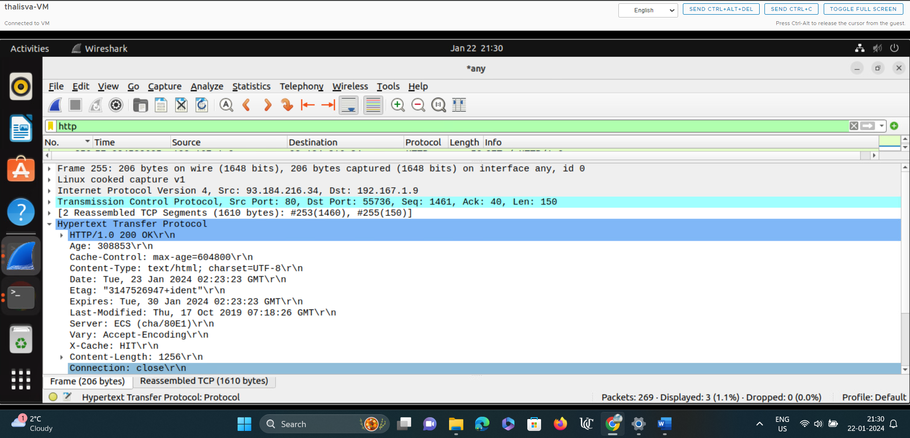

# waph-thalisva\
# WAPH-Web Application Programming and Hacking

## Instructor: Dr. Phu Phung

## Student

**Name**: Varsha Thalishetti

**Email**: thalisva@ucmail.uc.edu 

## Lab-0 Overview

The lab is covered in Lecture 2, In part 1,i need to deploy an Ubuntu 22.04 Virtual Machine on the provided environment and install software and applications. In part 2, I need to clone the repository.

### part1 - Ubuntu Virtual Machine & Software Installation

step 1: Firstly, I need to develop ubuntu virtual machine
Step 2: Then after, I have i need to run system by giving password
Step 3: I need to install required software like apache,pandoc and git

 

### part2 - Git Repositories and Exercise

I have uploaded the screenshot of the repository

Steps of Private Repository

Step 1: create a repository by clicking on new repository
Step 2: While creating repository click private and add README file and apache to the repository and click on the create button.

Hands-on hacking exercises

