# WAPH-Web Application Programming and Hacking
## Instructor name: Dr.Phu Phung

## Student info: 
 
*Name*: Varsha Thalishetti

*Email*: thalisva@mail.uc.edu


##  My_Repository_Information

Repository's URL: [https://github.com/thalisva/waph-thalisva]

# Lab 2 - Front-end Web Development 

### Task 1: Basic HTML with forms, and JavaScript 

#### a.HTML

I developed a HTML file named waph-thalisva.html with some basic tags, an image and some form tags.

##### code of the HTML
<!DOCTYPE html>
```<html>
<head>
    <meta charset="utf-8">
</head>
<body>
    <div id="top">
        <h1>Web Application Programming and Hacking</h1>
        <h2>Front-End_Web_Development_Lab</h2>
        <h3>Instructor: Dr. Phu Phung</h3>
    </div>
    <div id="menubar">
        <h2>Student: Varsha Thalishetti</h2>
        

        <div id="digital-clock"></div>
    </div>
    <div id="main">
        <p> A simple HTML page </p>
        Using the <a href="https://www.w3schools.com/html">W3Schools template</a>

        <hr>
        <b>Interactions with the forms</b>
        <div>
            <i>Form with an HTTP GET Request</i>
            <form action="/echo.php" method="GET">
                Your input:<input name="data">
                <input type="submit" value="submit">
            </form>
        </div>
        <div>
            <i>Form with an HTTP POST Request</i>
            <form action="/echo.php" method="POST" name="echo_post">
                Your input:<input name="data" onkeypress="console.log('you have pressed a key')">
                <input type="submit" value="submit">
            </form>
        </div>        
    </div>
</body>
</html>

```


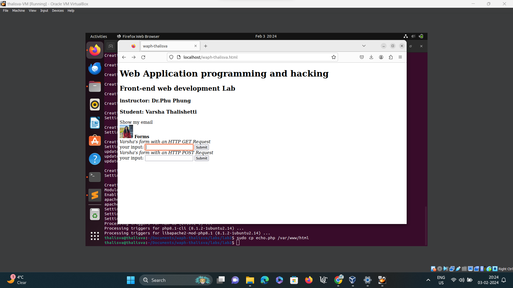

Caption: Screenshot of HTML basic tags, an image, and a form tag.

####  b. Simple JavaScript.

- Inline JavaScript code in HTML tags to display the current date/time
   
Here is the HTML code included;

```html
<div>
    <b>Experiments with JavaScript code</b><br>
    <i>Inlined JavaScript</i>
    <div id="date" onclick="document.getElementById('date').innerHTML = Date()">Click here to show Date()</div>
</div>

```


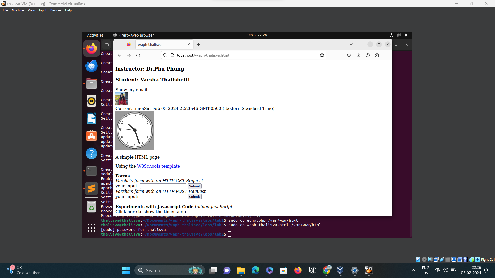

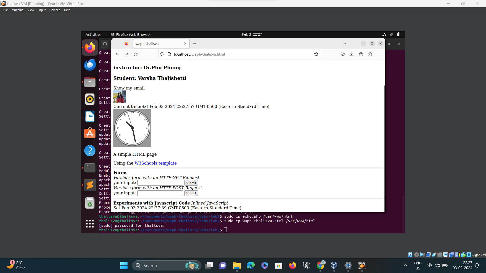
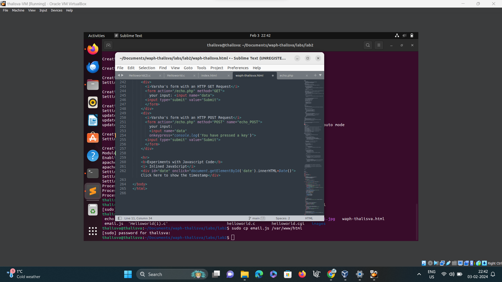

Caption: Screenshot displays the current date/time.

##### JavaScript code in a <script> tag to display a digital clock

Here is the HTML code included;

 ```html
<script type="text/javascript">
    function displayTime() {
        document.getElementById('digital-clock').innerHTML = "Current time: " + new Date();
    }
    setInterval(displayTime, 500);
</script>

```


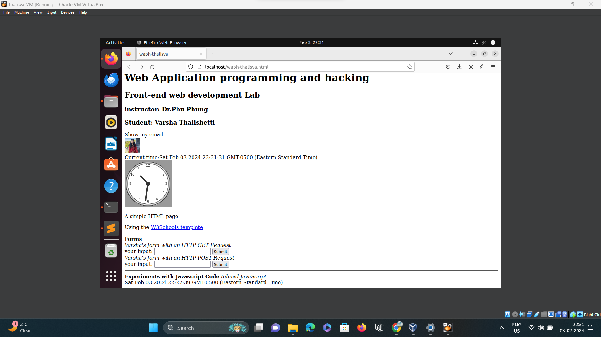

Caption: Screenshot that displays digital clock


- It does have email.js file to display email when we click on that

code of email.js code included;

email.js:
```html
var shown = false;

function showhideEmail() {
    if (shown) {
        document.getElementById('email').innerHTML = "show my email";
        shown = false;
    } else {
        var myemail = "<a href='mailto:thalisva" + "@" + "mail.uc.edu'>thalisva" + "@" + "mail.uc.edu</a>";
        document.getElementById('email').innerHTML = myemail;
        shown = true;
    }
}

```


Caption: Screenshot ofemail.js before clicking on that


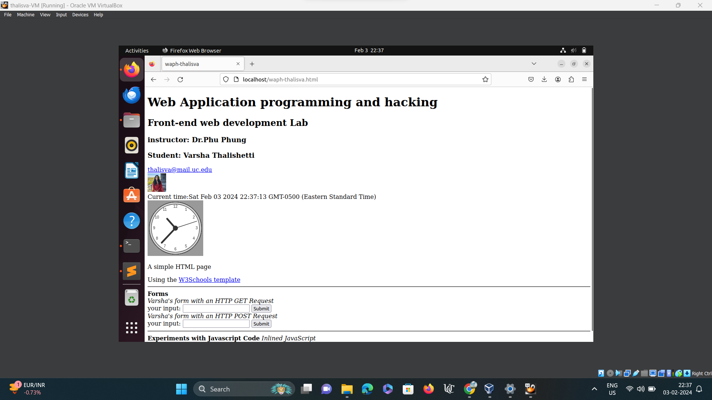
Caption: Screenshot of email after clicking on that 

(- Display's an analog clock using an external JavaScript code,and code of HTML page).

Here is the code:

```html
<div id="digital-clock"> </div>
<canvas id="analog-clock" width="150" height="150" style="background-color: #999"></canvas>
<script src="https://waph-uc.github.io/clock.js"></script>

<script>
    var canvas = document.getElementById("analog-clock");
    var ctx = canvas.getContext("2d");
    var radius = canvas.height / 2;
    ctx.translate(radius, radius);
    radius = radius * 0.90;
    setInterval(drawClock, 1000);

    function drawClock() {
        drawFace(ctx, radius);
        drawNumbers(ctx, radius);
        drawTime(ctx, radius);
    }
</script>

```


Caption: Screenshot of  Analog clock output

### Task 2: Ajax, CSS, jQuery, and Web API integration

####  a. Ajax

The code:

```html
<div>
    <i>Ajax request</i>
    <br>
    " Your Input: "
    <input name="data" onkeypress="console.log('you have pressed a key')" id="data">
    <script type="text/javascript">
        function getEcho() {
            var input = document.getElementById("data").value;
            if (input.length == 0) {
                return;
            }
            var xhttp = new XMLHttpRequest();
            xhttp.onreadystatechange = function() {
                if (this.readyState == 4 && this.status == 200) {
                    console.log("Received data =" + xhttp.responseText);
                    document.getElementById("response").innerHTML = "Response from server:" + xhttp.responseText;
                }
            }
            xhttp.open("GET", "echo.php?data=" + input, true);
            xhttp.send();
            document.getElementById("data").value = "";
        }
    </script>
</div>

```


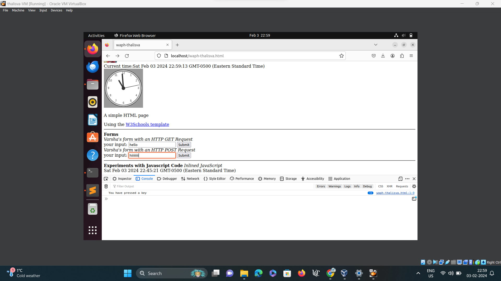

Caption: Screenshot of Ajax testing


#### b. CSS Inline, Internal , External

The code:

```html
    <!DOCTYPE html>
<html>
<head>
    <link rel="stylesheet" href="styles.css">
    <link rel="stylesheet" href="https://waph-uc.github.io/style1.css">
    <meta charset="utf-8">

   <style>
    body{background-color: powderblue;}
    h1 {color:blue;}
  </style> 
   
</head>
<body>
    <div id="top">
        <h1 style="color:blue";>Web Application Programming and Hacking</h1>
        <h2>Front-end Web Development Lab</h2>
        <h3>Instructor: Dr. Phu Phung</h3>
    </div>
</body>
</html>

```


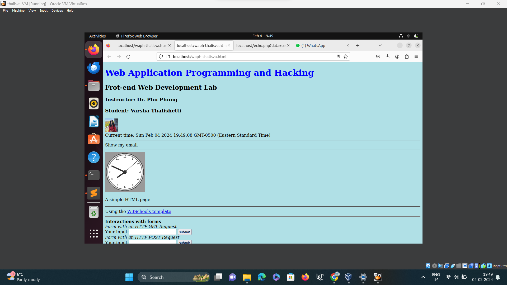

Caption: Screenshot of CSS background 


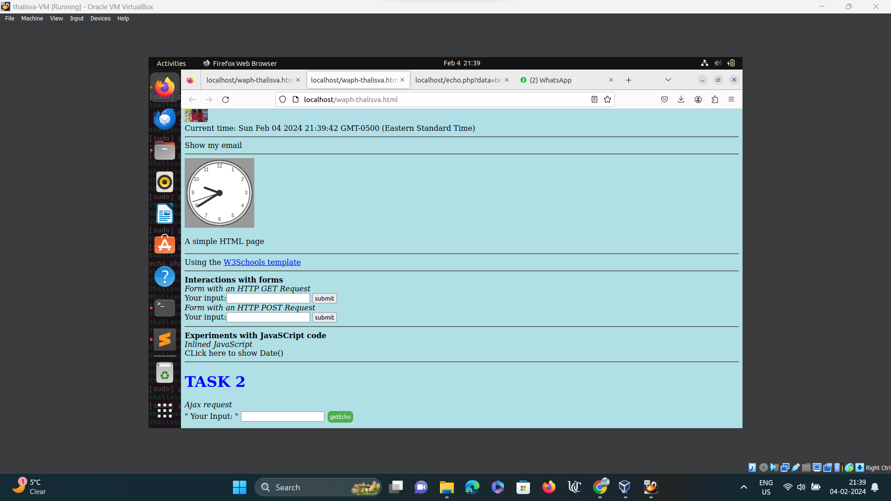

Caption:  Screenshot of the CSS 


####  c. jQuery
```html
<script src="https://code.jquery.com/jquery-3.7.1.min.js" integrity="sha256-/JqT3SQfawRcv/BIHPThkBvs0OEvtFFmqPF/lYI/Cxo=" crossorigin="anonymous"></script>
<div>
    <i>Ajax request</i>
    " Your Input: "
    <input name="data" onkeypress="console.log('you have pressed a key')" id="data">
    <input class="button round" type="button" value="Ajax Echo" onclick="getEcho()">
    <input class="button round" type="button" value="Ajax jQuery GET" onclick="jQueryAjax()">
    <input class="button round" type="button" value="Ajax jQuery POST" onclick="jQueryAjaxPost()">
    <script>
        function jQueryAjax() {
            var input = $("#data").val();
            if (input.length == 0) {
                return;
            }
            $.get("echo.php?data=" + input,
                function(result) {
                    $("#response").html("Response from server:" + result);
                });
            $("#data").val("");
        }

        function jQueryAjaxPost() {
            var input = $("#data").val();
            if (input.length == 0) return;
            $.post("echo.php", { data: input },
                function(result) {
                    $("#response").html("Response from server:" + result);
                }
            );
            $("#data").val("");
        }
    </script>
</div>

```


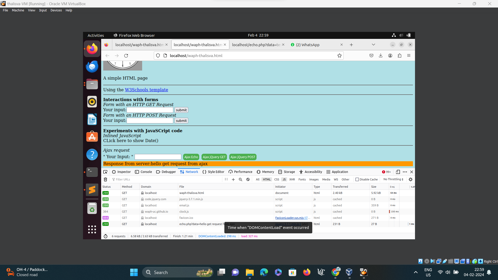
Caption: Screenshot of the jquery for GET Ajax

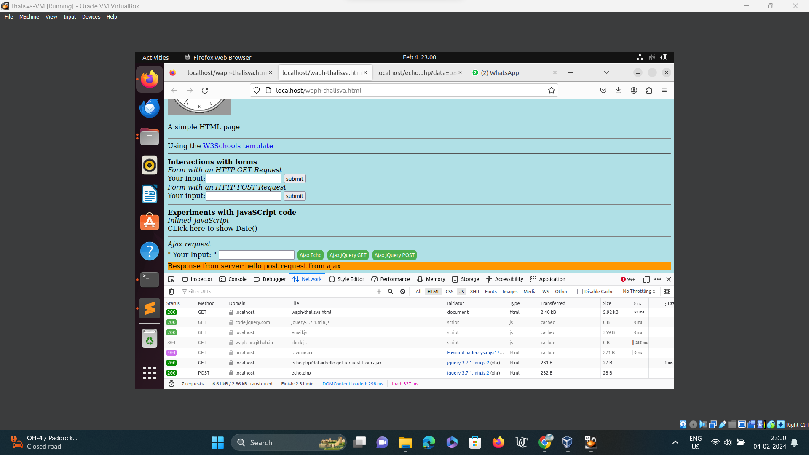
Caption: Screenshot of the jquery for POST Ajax


#### d. Web API integration 

The code:

```html

$.get("https://v2.jokeapi.dev/joke/Programming?type=single",
    function(result) {
        console.log("From jokeAPI: " + JSON.stringify(result));
        $("#response").html("A programming joke of the day: " + result.joke);
    });

```


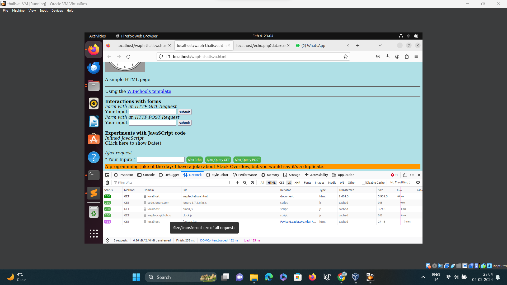
Caption: Screenshot of  the WebApi console 

d2) Here is the code included:

```html

async function guessAge(name) {
    const response = await fetch("https://api.agify.io/?name=" + name);
    const result = await response.json();
    $("#response").html("Hi " + name + ", your age should be " + result.age);
}

```


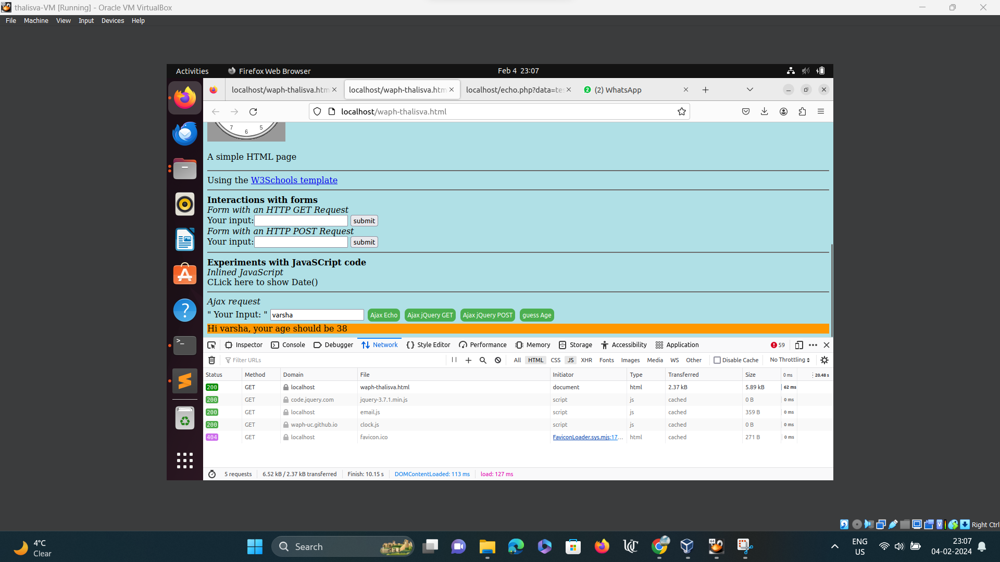
Caption: Screenshot of age function
